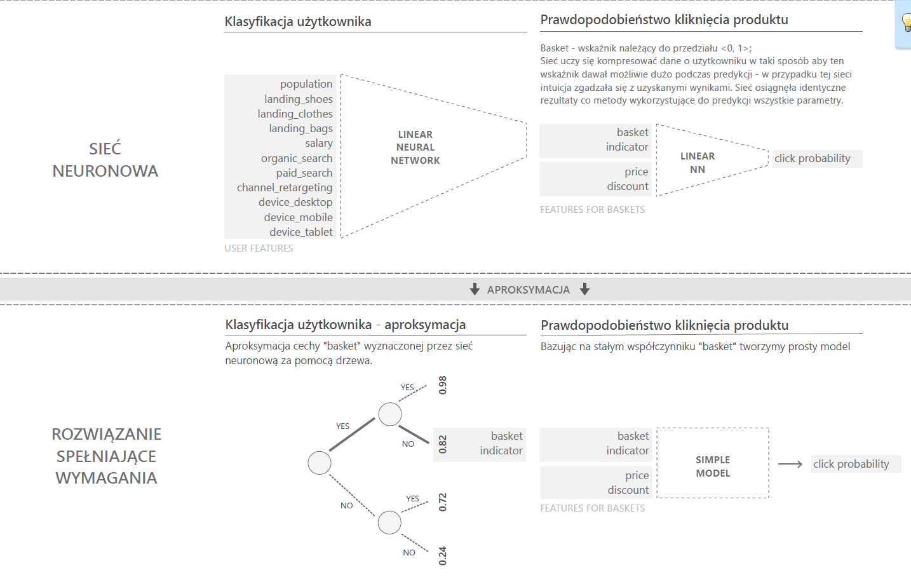

# Kompresja cech - Sieć neuronowa

Katalog zawiera zbudowany model liniowej sieci neuronowej użytej przez nas do kompresji cech w segmentach. Do treningu użyto  biblioteki `PyTorch`.

W notatniku `data_preparation` znajduje się inspekcja danych na których trenowano sieć.

Grafika poniżej znajduje się również w formacie PDF.

Schemat działania sieci:

